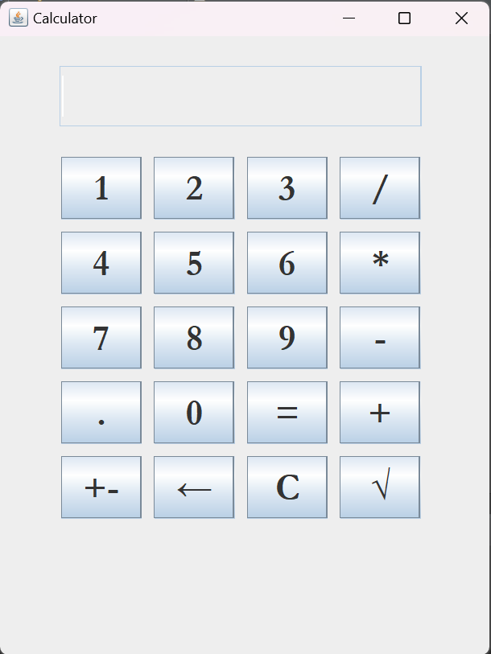

# Java Calculator

## Description
Java Calculator is a Java-based calculator application. 
The source code is based on a tutorial found on [YouTube](https://www.youtube.com/watch?v=dfhmTyRTCSQ&t=539s&ab_channel=BroCode). 
The app supports basic operations such as addition, subtraction, multiplication, division and square root.

## Contributions and Issues
If you find bugs or have suggestions to improve the calculator, feel free to open a new issue or submit a pull request.

## License
This project is under the [MIT License](LICENSE).

